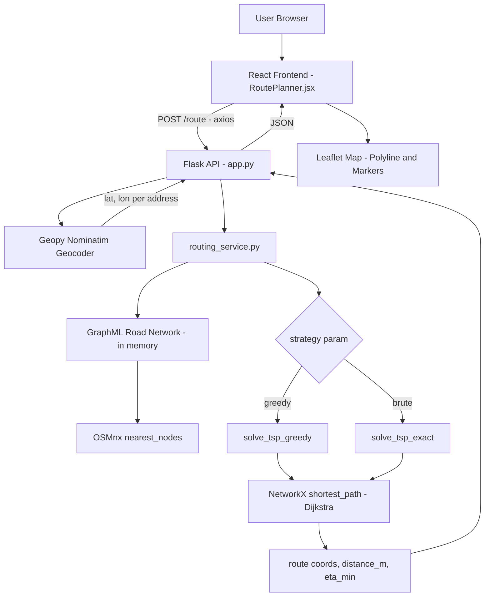

# FlipRoute

A multi-stop route optimization engine that combines OpenStreetMap road network data with graph-search and TSP heuristics to compute the shortest real-road route through an arbitrary set of waypoints.

---

## Overview

FlipRoute is a full-stack route planning application built around a single engineering problem: given a start address, an end address, and any number of stops in between, what is the shortest path through all of them that actually follows drivable roads — not straight lines on a map?

The system is split into two services. A Flask backend loads a pre-downloaded OpenStreetMap road network for a city (stored as a `.graphml` file), geocodes free-text addresses into coordinates, snaps those coordinates onto the nearest road network node, determines a stop order using one of two TSP strategies, and computes the shortest path between consecutive stops with Dijkstra's algorithm via NetworkX. A React frontend, built on top of an existing component library, exposes this through a sidebar form and a live Leaflet map that renders the returned polyline and stop markers.

The repository began life as a vehicle/ambulance booking front end (the npm package is still named `amulink`, and the codebase retains a full set of legacy pages — ambulance dispatch, hospital listings, donation flows). FlipRoute's route-optimization feature lives alongside that legacy UI, sharing its navbar, footer, and routing shell, while introducing its own backend service and a dedicated `/optimizer` page.

---

## Problem Statement

Routing between two points is a solved problem — every map application does it. Routing through an ordered or unordered set of intermediate stops is not. The number of possible visiting orders grows factorially with the number of stops (10 stops produce 3.6 million possible permutations), so naive "compute every order" approaches collapse quickly, while naive nearest-neighbor approaches can produce visibly inefficient routes for larger stop counts.

This is the daily operating problem for:

- **Last-mile delivery services** sequencing 5–15 drop-offs per driver shift
- **Courier and parcel companies** building round trips that minimize total drive time
- **Field service and field sales teams** visiting multiple addresses per day
- **Small businesses and individual operators** (local delivery, errands, multi-stop pickups) without access to enterprise routing software

FlipRoute addresses the core of this problem — multi-stop order optimization on a real road network — without the operational overhead (driver assignment, time windows, vehicle capacity) of full fleet-management platforms.

---

## Solution

FlipRoute converts a list of addresses into an ordered, drivable route in four stages:

1. **Geocoding** — each address string is resolved to latitude/longitude coordinates via the Nominatim (OpenStreetMap) geocoding service.
2. **Graph snapping** — each coordinate is matched to its nearest node in a pre-loaded road network graph using OSMnx's nearest-node search.
3. **Stop ordering** — the intermediate waypoints are reordered into a low-cost visiting sequence using either a greedy nearest-neighbor heuristic or an exact brute-force search over all permutations.
4. **Shortest-path computation** — for each consecutive pair of stops in the resolved order, Dijkstra's algorithm (via `networkx.shortest_path`, weighted by edge length) computes the actual road-following path. These segments are concatenated into one continuous route and returned to the frontend for rendering.

The result is a route, total distance, and an estimated time of arrival, computed entirely from real road geometry rather than straight-line ("as the crow flies") distance.

---

## Key Features

### Multi-stop route input
A sidebar form accepts a start address, an end address, and an arbitrary number of intermediate waypoints, with add/remove controls for the waypoint list. This exists because real-world routing problems rarely involve just two points — the form is built to scale to however many stops the user needs to add or remove on the fly.

### Two route-ordering strategies
The backend exposes a `strategy` parameter (`Backend/services/routing_service.py`) that switches between:
- **Greedy nearest-neighbor** (`solve_tsp_greedy`) — at each step, visits whichever unvisited waypoint has the shortest graph-distance from the current position. This runs in polynomial time and scales to large waypoint counts, at the cost of not guaranteeing the global optimum.
- **Exact brute-force search** (`solve_tsp_exact`) — evaluates every permutation of waypoints via `itertools.permutations` and selects the one with the lowest total path length. This guarantees the optimal stop order but has factorial time complexity, making it practical only for small waypoint counts.

This exists because route quality and computation time trade off against each other, and different use cases (a handful of must-visit stops vs. a long delivery run) call for different points on that trade-off.

### Real road-network shortest paths
Rather than computing straight-line distance between stops, every leg of the route is resolved with Dijkstra's algorithm over the actual OpenStreetMap drivable road graph, weighted by real segment length in meters. This is what makes the output a route a vehicle can actually drive, rather than an abstract point-to-point estimate.

### Interactive Leaflet map rendering
The computed route is drawn as a polyline on a Leaflet map (`Components/RoutePlanner/RoutePlanner.jsx`), with custom start/end/waypoint markers built from React Icons rendered to static HTML via `react-dom/server`. The map automatically fits its bounds to the returned route on every new request.

### Local road-network caching
Road graphs are downloaded once per city via OSMnx (`Backend/services/graph.py`, `Backend/test_graph.py`) and persisted to disk as `.graphml` files, avoiding repeated calls to the Overpass API on every server restart. OSMnx's own HTTP response cache (`Backend/cache/`) further avoids redundant Overpass queries during graph construction.

---

## Technology Stack

| Layer | Technology | Purpose |
|---|---|---|
| Frontend framework | React 18 | Component-based UI |
| Frontend routing | React Router DOM 6 | Client-side page routing (`/`, `/optimizer`, `/analytics`, `/about`, `/contact`, `/login`, `/bookambulance`) |
| Mapping (frontend) | Leaflet + React-Leaflet | Interactive map rendering, polylines, markers |
| HTTP client | Axios | Frontend → backend API calls |
| Styling | Tailwind CSS + custom CSS | Utility-first styling with a custom teal theme color |
| Icons | React Icons, React Feather | UI iconography |
| Animation | Framer Motion, AOS | Scroll/entry animations on legacy marketing pages |
| Backend framework | Flask | HTTP API server |
| Cross-origin support | Flask-CORS | Allows the React dev server to call the Flask API |
| Geocoding | Geopy (Nominatim) | Address string → latitude/longitude |
| Road network acquisition | OSMnx | Downloads and serializes OpenStreetMap drivable road graphs |
| Graph algorithms | NetworkX | Dijkstra shortest path, path-weight summation, nearest-node search support |
| Route data format | GraphML (`.graphml`) | On-disk serialization of the road network graph |

`Backend/requirements.txt` also lists `scikit-learn`, though no scikit-learn import currently appears in the backend source.

---

## System Architecture



The graph itself is loaded once at process startup (`G = load_graph("ranchi")` in `app.py`) and held in memory for the lifetime of the server process, rather than being re-read from disk on every request.

---

## Application Workflow

1. User enters a start address, optional waypoint addresses, and an end address in the sidebar form on the `/optimizer` page.
2. On clicking "Get Route," the frontend sends a `POST /route` request to the Flask backend with `{ start, waypoints, end }`.
3. The backend geocodes every address via Nominatim. If any address fails to resolve, the request returns a `400` error naming the failed address.
4. Each resolved coordinate is snapped to its nearest node in the in-memory road graph.
5. The waypoint visiting order is computed by the selected TSP strategy (greedy by default).
6. Dijkstra's algorithm computes the shortest path between each consecutive pair of stops in that order; segments are concatenated into a single route.
7. The backend returns the route as a list of `(lat, lon)` coordinates, the total distance in meters, and an estimated time of arrival in minutes.
8. The frontend renders the route as a polyline on the Leaflet map and fits the map viewport to the route bounds.

---

## Route Optimization Engine

### Graph representation

The road network is modeled as a directed graph (`networkx.MultiDiGraph`, as produced by OSMnx) where:
- **Nodes** represent intersections and road endpoints, carrying `x`/`y` (longitude/latitude) coordinates and a `street_count` attribute.
- **Edges** represent road segments between two nodes, carrying attributes including `length` (meters), `highway` (road classification), `oneway`, `maxspeed`, and `name`.

This is the standard OSMnx graph schema: real-world streets become weighted edges, and the entire optimization problem becomes a graph search problem.

### Shortest path: Dijkstra's algorithm

Each leg of a route (one stop to the next, in resolved order) is computed with `networkx.shortest_path(graph, source, target, weight="length")`, which uses Dijkstra's algorithm under the hood for non-negative edge weights. Edge weight is real road segment length in meters, so the resulting path is the genuinely shortest drivable route between two points — not a straight-line approximation.

- **Time complexity**: O((V + E) log V) per shortest-path query, where V and E are the number of nodes and edges in the graph (Dijkstra with a binary heap).
- **Space complexity**: O(V + E) for the graph itself, plus O(V) for the algorithm's internal distance and priority-queue state.

### Stop ordering: a Traveling Salesman sub-problem

Once the start, end, and waypoints are fixed, choosing the order in which to visit the waypoints is a path-constrained variant of the Traveling Salesman Problem (open-path TSP — start and end are fixed, not on a cycle). FlipRoute implements two solvers for this:

**Greedy nearest-neighbor (`solve_tsp_greedy`)**
At each step, the algorithm computes the graph-distance from the current node to every remaining unvisited waypoint and moves to whichever is closest, repeating until all waypoints are visited and then proceeding to the end node.
- Time complexity: O(k² · (V + E) log V), where k is the number of waypoints — each of the k steps scans the remaining waypoints and runs a shortest-path query against each.
- Tradeoff: fast and scales linearly-ish with realistic waypoint counts, but is a local-greedy heuristic and is not guaranteed to find the globally shortest visiting order.

**Exact brute-force (`solve_tsp_exact`)**
Every permutation of the waypoint list is evaluated in full; for each permutation, the total path length across all legs is summed, and the minimum-total permutation is selected.
- Time complexity: O(k! · k · (V + E) log V) — factorial in the number of waypoints, since every ordering is tried.
- Tradeoff: guarantees the optimal stop order, but becomes computationally infeasible beyond roughly 8–10 waypoints (10! is already 3.6 million permutations).

The `strategy` request parameter (`"greedy"` by default, `"brute"` for exact) selects between these at request time. The frontend currently sends an `optimize` field (`"time"` / `"distance"`) rather than `strategy`, so in the current wiring the backend always falls back to its default `"greedy"` behavior — see [Known Gaps](#known-gaps--engineering-notes) below.

---

## Mapping & Geospatial Processing

**OpenStreetMap** is the underlying source of road network and address data — a free, community-maintained global map dataset.

**OSMnx** is the Python library responsible for turning OpenStreetMap's raw data into a usable graph: `ox.graph_from_place()` queries the Overpass API for a named place's drivable street network and returns it as a NetworkX graph; `ox.save_graphml()` / `ox.load_graphml()` persist that graph to and from disk; `ox.distance.nearest_nodes()` snaps arbitrary lat/lon coordinates onto the nearest graph node.

**NetworkX** provides the underlying graph data structure and the shortest-path algorithms (Dijkstra) that operate on it once OSMnx has built the graph.

**Leaflet** (via React-Leaflet) renders the final result — the road network itself is never sent to or rendered by the frontend; only the computed route polyline and stop coordinates are.

**Geopy / Nominatim** bridges free-text addresses (what a user types) and the lat/lon coordinate space that OSMnx graphs operate in.

End-to-end geospatial flow:

```
Address text (user input)
   → Nominatim geocoding → (lat, lon)
   → OSMnx nearest_nodes → graph node ID
   → NetworkX shortest_path (Dijkstra) → ordered list of node IDs
   → node x/y lookup → (lat, lon) polyline
   → Leaflet Polyline + Markers (visualization)
```

### Road network data

The repository ships one pre-downloaded graph: `Backend/data/graphs/mumbai,_india.graphml`, an 18 MB drivable street network for Mumbai containing approximately **18,700 nodes** and **43,000 edges**. Additional cities can be downloaded with the helper scripts described below.

---

## Backend Design

### Architecture

The backend is a single-process Flask application (`Backend/app.py`). It loads one road network graph into memory at startup and exposes a small JSON API over it. There is no database, no authentication layer, and no persistent request storage — each request is geocoded, routed, and responded to statelessly against the in-memory graph.

### Endpoints

| Method | Path | Request Body | Response | Description |
|---|---|---|---|---|
| `GET` | `/` | — | Plain text status string | Health check / liveness confirmation |
| `POST` | `/route` | `{ "start": string, "end": string, "waypoints": string[], "strategy": "greedy" \| "brute" (optional, default "greedy") }` | `{ "route": [[lat, lon], ...], "distance_m": int, "eta_min": float, "status": "success" }` on success; `{ "error": string }` with HTTP 400/500 on failure | Geocodes all addresses, computes the optimized multi-stop route, and returns the route polyline, total distance, and ETA |

### Request validation and error handling

- A missing `start` or `end` address returns HTTP 400 with an explanatory error before any geocoding is attempted.
- Each address is geocoded individually; if any single address fails to resolve, the endpoint immediately returns HTTP 400 naming the specific address that failed, rather than failing silently or substituting a default location.
- Any unhandled exception during routing (e.g., a coordinate that cannot be snapped to the graph) is caught at the top level of the `/route` handler and returned as HTTP 500 with the exception message.
- CORS is enabled globally via `flask-cors`, allowing the React development server (a different origin/port) to call the API directly.

### ETA calculation

Estimated time of arrival is derived from total route distance using a fixed assumed average speed of 35 km/h (`Backend/app.py`) — `eta_min = total_distance / (35 * 1000 / 60)`. This is a static assumption rather than a value derived from posted speed limits or live traffic data; `Backend/config/settings.py` separately defines a `SPEED_KMPH = 40` constant that is not currently referenced by the routing calculation.

---

## Frontend Design

### Component hierarchy

```
App.js (Router)
├── Home (/)              → Navbar, Hero, Counter, Howwork, Aboutus, Ouroffer, Review, Faq, Gift, Footer
├── Optimizer (/optimizer) → Navbar, RoutePlanner, Footer        ← FlipRoute's core feature
├── Bookambulance           → Navbar, AmbulanceHomeSection, Vehical, Ambulancelist, Banner, Footer
├── About (/about)         → Navbar, Documentation, Footer
├── Contact (/contact)     → Navbar, Contacthero, Contact, Footer
├── Analytics (/analytics) → Navbar, Developercard, Footer
└── Login (/login)         → Navbar, Footer
```

`RoutePlanner.jsx` is where the application's actual engineering value lives: it owns all route-planning state (`start`, `end`, `waypoints`, `route`, `distance`, `time`, `loading`, `error`), issues the API call to the backend, and renders both the input sidebar and the live Leaflet map.

### State management

State is handled entirely with local component state (`useState`) — there is no global state library (Redux, Context API, Zustand, etc.) in use. This is appropriate given the application's current scope: route-planning state is local to a single page and does not need to be shared across components.

### Map interaction

`RoutePlanner.jsx` defines a small `FitBounds` helper component that uses React-Leaflet's `useMap()` hook to automatically pan/zoom the map to fit the returned route's bounding box on every successful request. Start, end, and waypoint markers are rendered with custom icons built by converting React Icon components to static HTML strings via `react-dom/server`'s `renderToStaticMarkup`, then wrapped in Leaflet `divIcon`s — this allows React Icons (rather than static image files) to be used as map markers.

### Routing & navigation

Client-side routing uses `react-router-dom` v6 (`BrowserRouter`, `Routes`, `Route`). The `Navbar` component performs login-state checks via `localStorage.getItem("authToken")`, but no backend authentication endpoint exists in this repository — the login page (`Login.js`) currently renders only a `Navbar` and `Footer` with no form.

---

## Engineering Challenges

**Large road network processing.** A city-scale drivable road graph (Mumbai: ~18,700 nodes, ~43,000 edges) is too large to recompute from OpenStreetMap on every request. FlipRoute addresses this by downloading and serializing the graph once (`ox.save_graphml`) and loading it into memory a single time at server startup, so every subsequent request reuses the same in-memory graph object rather than re-querying Overpass or re-parsing GraphML per request.

**Snapping free-form input onto a discrete graph.** Users provide addresses as text and expect a route between exact locations, but the routing algorithm can only operate on graph nodes. This is bridged in two steps: Nominatim resolves text to continuous lat/lon coordinates, and `ox.distance.nearest_nodes` resolves those coordinates to the nearest discrete graph node — converting an open-ended geocoding problem into a closed graph-search problem.

**Multi-stop order optimization under combinatorial growth.** Optimal ordering of waypoints is factorial in the number of stops. FlipRoute addresses this with two solvers at opposite ends of the speed/optimality trade-off (greedy heuristic vs. exact brute force) rather than committing to a single approach, letting the caller choose the appropriate one for the waypoint count involved.

**Combining multiple shortest-path segments into one continuous route.** Because the road-following path between any two stops can revisit shared nodes at segment boundaries, `routing_service.py` deduplicates the seam between consecutive path segments (`path if i == 0 else path[1:]`) so the final route does not contain a duplicated coordinate at every stop.

---

## Folder Structure

```
FlipRoute-main/
├── Backend/
│   ├── app.py                      # Flask app entrypoint, /route endpoint, geocoding, graph load
│   ├── config.py                   # Legacy single-graph path constant
│   ├── config/
│   │   └── settings.py             # BASE_DIR, GRAPH_DIR, DEFAULT_CITY, SPEED_KMPH
│   ├── services/
│   │   ├── graph.py                # download_graph() / load_graph() via OSMnx
│   │   └── routing_service.py      # Core TSP + Dijkstra route computation logic
│   ├── utils/
│   │   ├── graph_loader.py         # load_graph(city, state) helper used by app.py
│   │   └── geocode.py              # Standalone Nominatim geocode helper (Jharkhand-bounded)
│   ├── data/
│   │   └── graphs/
│   │       └── mumbai,_india.graphml   # Pre-downloaded Mumbai drivable road network
│   ├── cache/                      # OSMnx's Overpass API response cache (auto-generated)
│   ├── test_graph.py               # Script to download additional city graphs
│   └── requirements.txt
│
├── Frontend/
│   ├── public/                     # Static HTML shell, favicon, manifest
│   ├── src/
│   │   ├── App.js                  # Route definitions
│   │   ├── index.js                # React DOM entrypoint
│   │   ├── Pages/                  # One file per route: Home, Optimizer, About, Contact, Analytics, Login, Bookambulance
│   │   └── Components/
│   │       ├── RoutePlanner/       # Core route-planning UI + Leaflet map (FlipRoute's primary feature)
│   │       ├── Navbar/, Footer/    # Shared layout
│   │       ├── Hero/, Counter/, Howwork/, Aboutus/, Ouroffer/, Review/, Faq/, Donation/   # Home page marketing sections
│   │       ├── AmbulanceHomeSection/, Vehicaloption/, Ambulancelist/, Banner/             # Legacy ambulance-booking flow
│   │       ├── Documentation/      # About page profile section
│   │       ├── Contacthero/, Contact/   # Contact page
│   │       ├── Developercard/      # Analytics page content (developer contact card)
│   │       └── assets/             # Shared image/icon assets
│   ├── package.json
│   ├── tailwind.config.js
│   └── postcss.config.js
│
├── FlipRoute.png                   # Logo / wordmark
└── README.md
```

---

## Installation Guide

### Prerequisites

- Python 3.10+ (the included `__pycache__` artifacts indicate development against CPython 3.12)
- Node.js 16+ and npm
- Internet access at runtime for the Nominatim geocoding API, and (only when downloading a new city graph) the Overpass API

### Backend Setup

```bash
cd Backend
python -m venv venv

# Windows
venv\Scripts\activate
# macOS / Linux
source venv/bin/activate

pip install -r requirements.txt
```

The backend currently loads the **Ranchi** graph by default (`G = load_graph("ranchi")` in `app.py`, resolving to `data/graphs/jharkhand/ranchi.graphml`). This file is not included in the repository — only `data/graphs/mumbai,_india.graphml` is present. To run the server as-is, either:

- Download the Ranchi graph first (see [Downloading a new city graph](#downloading-a-new-city-graph) below), or
- Edit `app.py` to load an available graph instead, e.g.:
  ```python
  G = load_graph("mumbai,_india")  # adjust load_graph()'s path logic accordingly
  ```

### Frontend Setup

```bash
cd Frontend
npm install
```

### Environment Variables

No `.env` file or environment-variable usage is present anywhere in the current backend or frontend source. All configuration (graph paths, default city, assumed speed, backend port) is hardcoded in `app.py`, `config.py`, and `config/settings.py`. The frontend's API base URL is hardcoded to `http://127.0.0.1:8000` in `RoutePlanner.jsx`.

### Running Locally

In one terminal:
```bash
cd Backend
venv\Scripts\activate   # or: source venv/bin/activate
python app.py
```
The Flask server starts on `http://127.0.0.1:8000` with `debug=True`.

In a second terminal:
```bash
cd Frontend
npm start
```
The React dev server starts on `http://localhost:3000`. Navigate to `/optimizer` to use the route planner.

### Downloading a new city graph

`test_graph.py` shows the pattern for downloading and saving a new city's road network:

```python
import osmnx as ox
G = ox.graph_from_place("Ranchi, Jharkhand, India", network_type="drive")
ox.save_graphml(G, "data/graphs/jharkhand/ranchi.graphml")
```

`Backend/services/graph.py` exposes the same operation as a reusable `download_graph(place_name)` function.

### Production Build

```bash
cd Frontend
npm run build
```
This produces an optimized static build via Create React App's standard build pipeline. No production deployment configuration (Dockerfile, WSGI server config, CI/CD pipeline, or hosting setup) is currently present in the repository — `app.py` runs with Flask's built-in development server (`app.run(debug=True, port=8000)`), which is not intended for production use.

---

## Screenshots

```md
docs/screenshots/home.png
docs/screenshots/optimizer-route-result.png
docs/screenshots/optimizer-empty-state.png
```

*(Screenshot directory not yet present in the repository — add captures of the `/optimizer` page before and after a route request.)*

---

## Engineering Highlights

- **In-memory graph reuse**: the road network is parsed from GraphML exactly once per process lifetime, not per request — a meaningful cost saving given the graph is tens of megabytes and tens of thousands of nodes.
- **Pluggable optimization strategy**: `get_optimized_route()` accepts a `strategy` argument and dispatches to one of two independent solver functions, making it straightforward to add a third strategy (e.g., a 2-opt local-search improvement on top of the greedy result) without touching the request-handling or path-stitching logic.
- **Segment stitching with seam deduplication**: route segments returned by repeated `nx.shortest_path` calls are concatenated with explicit handling of the shared boundary node (`path[1:]` for all but the first segment), avoiding duplicate coordinates at each stop in the final polyline.
- **Decoupled geocoding from routing**: address resolution (Nominatim) and path computation (NetworkX/OSMnx) are fully separate concerns connected only by coordinate tuples, so either could be swapped independently (e.g., a different geocoding provider) without touching the optimization logic.

---

## Known Gaps & Engineering Notes

In the interest of describing only what the repository actually contains, the following inconsistencies exist between the frontend and backend as currently committed:

- **Field name mismatch**: the backend returns `distance_m` and `eta_min`; the frontend reads `res.data.distance_km` and `res.data.travel_time_min`. As written, the UI's distance/ETA panel will display as empty for any successful response.
- **Missing `stops` field**: the frontend reads `res.data.stops` to place start/end/waypoint markers, but the backend's JSON response does not include a `stops` key — only `route`, `distance_m`, `eta_min`, and `status`. Markers will not currently render.
- **Strategy parameter mismatch**: the frontend sends `optimize` (`"time"` or `"distance"`); the backend reads `strategy` (`"greedy"` or `"brute"`). Since `optimize` is not read by the backend, every request currently runs with the default `"greedy"` strategy regardless of the dropdown selection.
- **Default city graph not bundled**: `app.py` loads the `"ranchi"` graph by default, but only a Mumbai graph ships in `Backend/data/graphs/`. The server will raise a file-not-found error on startup unless a Ranchi graph is downloaded first or `app.py` is pointed at the bundled Mumbai file.
- **Legacy template content**: the About page (`Documentation.js`) currently renders Lorem ipsum placeholder text, and `App.test.js` still contains Create React App's default "learn react" test, which will fail against the current UI.

None of the above affects the soundness of the routing algorithm itself (geocoding → graph snapping → TSP ordering → Dijkstra path-stitching all function correctly when exercised directly against the backend); they affect the current wiring between the two services and the page-template content inherited from the project's origin as an ambulance-booking application.

---

## Future Enhancements

- Align the `/route` response schema with what `RoutePlanner.jsx` actually consumes (or vice versa), and add a `stops` field to the response.
- Wire the frontend's "Optimize For" dropdown to the backend's `strategy` parameter, and consider adding a true distance-vs-time optimization mode (currently both modes return the same distance-weighted shortest path).
- Replace the fixed 35 km/h ETA assumption with edge-level `maxspeed` data, which is already present in the GraphML schema but unused in the ETA calculation.
- Support dynamic graph loading by city (the data layer already supports multiple cities via `services/graph.py`; the API does not yet expose a way to select one per request).
- Add a production-grade WSGI server (e.g., Gunicorn) and containerization for deployment beyond Flask's development server.
- Replace the `localStorage`-based login-state stub with a real authentication endpoint, or remove the auth UI until one exists.

---

## Skills Demonstrated

- **Graph theory & algorithms**: directed weighted graph modeling of a real road network; Dijkstra's shortest-path algorithm; combinatorial optimization (TSP) via both greedy heuristic and exact brute-force search, with explicit reasoning about their time-complexity trade-offs.
- **Geospatial computing**: working with GraphML-serialized OpenStreetMap data, coordinate-to-node snapping, and geocoding integration via OSMnx and Geopy.
- **API development**: a Flask REST endpoint with input validation, per-address error reporting, and structured JSON responses.
- **Full-stack integration**: a React single-page application consuming a Python backend over HTTP, including interactive map rendering with Leaflet and custom marker construction from React components.
- **System design trade-offs**: a pluggable strategy pattern for route optimization that exposes an explicit speed/optimality choice to the caller rather than hardcoding one approach.

---

## Resume Impact

This project demonstrates the ability to take a real road network — not synthetic test data — and build a working optimization pipeline on top of it: geocoding integration, graph-based shortest-path computation, and a from-scratch implementation of two distinct TSP-solving strategies with documented complexity trade-offs, exposed through a complete full-stack application with live map visualization. It reflects comfort with graph algorithms, geospatial libraries (OSMnx, NetworkX, Leaflet), and the practical engineering of stitching multiple shortest-path queries into one continuous, deduplicated route.

---

## License

No `LICENSE` file is currently present in this repository. To make the project's licensing terms explicit, add a standard MIT license file at the repository root, for example:

```
MIT License

Copyright (c) 2026 Bhanu Prakash Pandey

Permission is hereby granted, free of charge, to any person obtaining a copy
of this software and associated documentation files (the "Software"), to deal
in the Software without restriction, including without limitation the rights
to use, copy, modify, merge, publish, distribute, sublicense, and/or sell
copies of the Software, and to permit persons to whom the Software is
furnished to do so, subject to the following conditions:

The above copyright notice and this permission notice shall be included in
all copies or substantial portions of the Software.

THE SOFTWARE IS PROVIDED "AS IS", WITHOUT WARRANTY OF ANY KIND, EXPRESS OR
IMPLIED, INCLUDING BUT NOT LIMITED TO THE WARRANTIES OF MERCHANTABILITY,
FITNESS FOR A PARTICULAR PURPOSE AND NONINFRINGEMENT. IN NO EVENT SHALL THE
AUTHORS OR COPYRIGHT HOLDERS BE LIABLE FOR ANY CLAIM, DAMAGES OR OTHER
LIABILITY, WHETHER IN AN ACTION OF CONTRACT, TORT OR OTHERWISE, ARISING FROM,
OUT OF OR IN CONNECTION WITH THE SOFTWARE OR THE USE OR OTHER DEALINGS IN
THE SOFTWARE.
```

---

## Author

**Bhanu Prakash Pandey**
Full Stack Developer

- GitHub: [https://github.com/BhanuPrakashPandey0843](https://github.com/BhanuPrakashPandey0843)
- LinkedIn: *(add link)*
